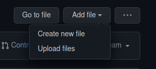

# Translation guide
First of all: This is a guide for absolute beginners. If you are familiar with Git and Github, please ignore the first chapters.
## Introduction
There is a german saying "Viele Wege führen nach Rom" (All roads lead to Rome), which means there are many ways to do a job. This is especially correct for git and it's ecosystem. There are billion ways to accomplish the result, but we will stick to the easiest.

### Glossary

|Git speak|Rest of the world|
|---|---|
|Repository|Basically a folder where all the files are stored. Can do some neat tricks|
|Commit|Point where you saved the project. It is possible to jump back to this point every time|
|Branch|Indivdual part of development. Won't affect anything on other branches (eg. dev and master)|
|Fork|Copy of the whole repository for own development/customazation|


### Requirements
You will need:
 1. A Laptop/PC
 2. An account on Github
	 -  Tutorial: https://docs.github.com/en/get-started/signing-up-for-github/signing-up-for-a-new-github-account

### Setup
For security reasons, remember every beta user will get the latest build from the dev branch, only a few people are allowed to commit their changes directly to the branches. Everyone else has to create a Pull Request to get their changes merged into the dev branch. To accomplish this we need to create a fork
 to copy the repository. You can leave anything at is was and click on "create fork". This could take a few seconds.

Now we should make sure to be up to date with the original repository. If you have your fork for a longer time please press the "fetch upstream"-Button occainsionally. Especially if GH tells you to do. And please make sure to be on the `dev` branch. Otherwise you may miss the latest changes (and maybe translations which have been already made).

## Translation
### Paths
There are a few points where the translation files are stored:
- Docs aka. Wiki
	 - `/docs/{lang}`  The main pages for the wiki 
Eg. `Suggestions.md` is https://proxy.lss-manager.de/v4/docs/en_US/suggestions.html
	-  `/docs/.vuepress/i18n` Some static strings
Eg. `home: "Back to home"`
- Main files (appstore)
	-  `/src/i18n`
- Modules
	- `/src/modules/{module}/i18n/` The translations for the modules
	-  `/src/modules/{module}/docs/` The wiki pages
- Some modules translations will contain a subfolder called `assets`. This folder is reserved for images in the wiki page
	- `/src/modules/{module}/i18n/assets/{lang}` 
	The images can be embedded with:
	 ``

To start a new translation create a new file by clicking on "Add file" and select "Create new file"


```json
If you need to create a new folder just do the same procedure but place a `/` behind the name and create a dummy file.
```

would create the folder "de_DE" with a dummy file in the "script" folder.

Please stick to the following scheme for file/folder names:
```
xx_YY
```
where xx is the language code after [ISO 639-1](https://en.wikipedia.org/wiki/List_of_ISO_639-1_codes) and YY is the country after [ISO 3166-1 alpha-2](https://en.wikipedia.org/wiki/ISO_3166-1_alpha-2#Officially_assigned_code_elements).
### "Best practice"
Every folder should contain a german and an english translation. The easiest way is to copy the content from this file into your new file. This prevents you to miss a bracket or comma.

## After translation
After you translated a file you need to write a commit message. If you wanna make us happy please use [gitmojis](https://gitmoji.dev) followed by the module name in square brackets and a quick summary (half sentence) what you changed (eg. translations es). Some long module names got inoffical abbreviations over the development.
### Abbreviation list
|Abbreviation| Module|Submodule|
|---|---|---|
|dcs|dailyCreditsSummary||
|eb| extendedBuilding||
|ab| asyncButtons||
|blf| buildingListFilter||
|ecl| extendedCallList||
|ecw| extendedCallWindow||
|  emv|extendedCallWindow| enhancedMissingVehicles|
|  tt|extendedCallWindow| tailored Tabs|
|em| extendedMap||
|ge| generalExtensions||
|mh| missionHelper||
|sap| ShareAlliancePost||
|docs| docs (main pagess only)||


## Creating a pull request

After you finished a modules, wiki page, etc. its time to transfer your improvments into the lss-manager repository. Github will show you a messages in your repository.
Click on "contribute" and "Open pull request"


This will lead you to an overview where you can see all your changes. Please make sure that you merge in the right repository (LSS-manager/LSSM-V.4) and in the right branch (dev)


You can also set a title for the pull request, if you don't know any good: copy the commit message.

**Make sure that the checkbox "Allow edits by maintainers" is set**

Otherwise the person who reviews the changes would not be able to make any changes.


Now somebody needs to review your changes and a program will check that there will be no syntax errors (missing comma, bracket, etc.).

If the review and the check is positive it will be merged into the development branch and your code is live for the beta testers. With the next release it will be availible for every user.

**Congratz, you contributed to the LSSM, thank you for your support!**