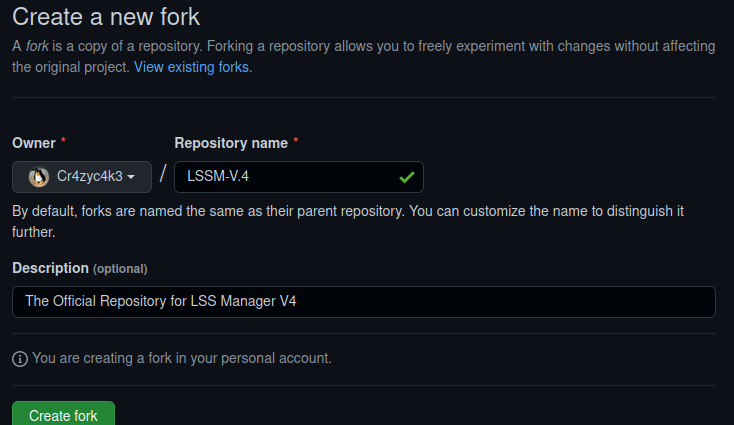

# Introduction
There is a german saying "Viele Wege führen nach Rom" (All roads lead to Rome), which means there are many ways to do a job. This is especially correct for git, and it's ecosystem. There are a billion ways to accomplish the result, but we will stick to the easiest.

## Glossary

| Git speak  | Rest of the world                                                                            |
|------------|----------------------------------------------------------------------------------------------|
| Repository | Basically a folder where all the files are stored. Can do some neat tricks                   |
| Commit     | Point where you saved the project. It is possible to jump back to this point every time      |
| Branch     | Individual part of development. Won't affect anything on other branches (eg. dev and master) |
| Fork       | Copy of the whole repository for own development/customization                               |

## Requirements
You will need:
1. A Laptop/PC
2. An account on GitHub
    -  [Tutorial](https://docs.github.com/en/get-started/signing-up-for-github/signing-up-for-a-new-github-account)

## Setup
For security reasons, remember every beta user will get the latest build from the dev branch, only a few people are allowed to commit their changes directly to the branches. Everyone else has to create a Pull Request to get their changes merged into the dev branch. To accomplish this we need to create a fork to copy the repository.

You can leave anything at is and click on "create fork". This could take a few seconds.

Now we should make sure to be up-to-date with the original repository. If you have your fork for a longer time please press the "fetch upstream"-Button occasionally, especially if GH tells you to do so. Please also make sure to be on the `dev` branch. Otherwise, you may miss the latest changes (and maybe translations which have been already made).

:::tip What's next?
* Read [how to commit a file](./committing.md)
* Read [hot to create a Pull Request](./prs.md)
* Read one of the special sections for contribution topics

:::
